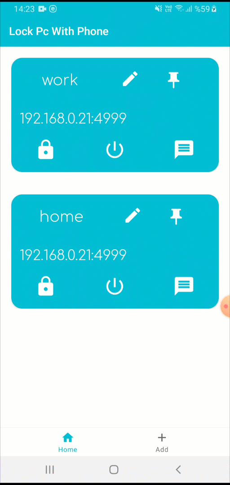
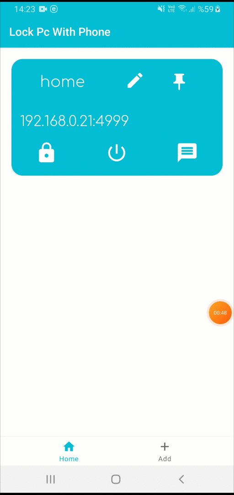

# Lock PC With Phone

## Features

- ✅ Add profile your different networks
- ✅ Lock, sleep of power off your computer from phone
- ✅ Send weblink, it will automatically open
- ✅ Send Clipboard data to your computer
- ✅ Send info message like a notification
- ☐ Receive data from computer
- ☐ Simulate key press

 ## 1. Add a new profile

* ####  You can add new profile with reading qr code.

 ## 2. Update or delete your profile

* ####  You can edit your profile in the dialog box.

 ## 3. Send Command or Message to the Computer

* ####  You can send message, data as a clipboard data or weblinks 

